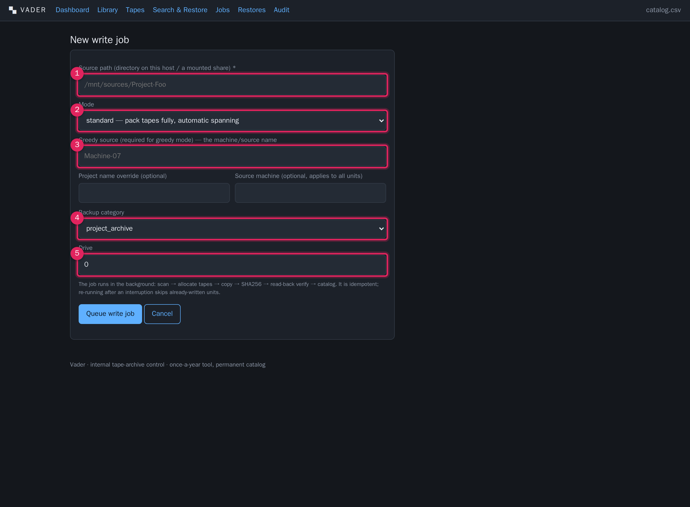
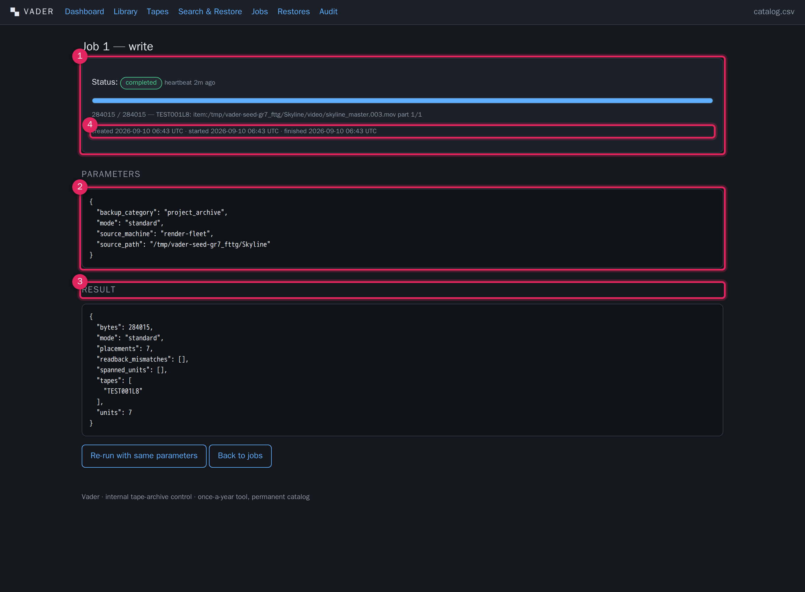

# Archiving

**What this covers — this is the primary chapter.** How to get content onto tape:
preparing a source tree, how Vader classifies what it finds (Types A–D), starting
a write job, standard vs greedy mode, automatic multi-tape spanning, the
write-time checksum and read-back verify, what makes a re-run safe, how to monitor
progress, what "done" looks like, and the catalog and manifest files Vader leaves
on each tape.

---

## 1. The write pipeline in one picture

For every write job, per unit of content, Vader runs:

```
scan source tree
      │
      ▼
classify into write units  ─────────►  Type A EXR sequence folder
(intake)                                Type B video chunk
                                        Type C config / logs
                                        Type D audio / media
      │
      ▼
allocate tape(s)  ──────────►  fits on an open/active tape?  → place whole
(spanning + greedy)            fits on a fresh scratch tape? → format + place whole
                              fits on no single tape?        → split at a safe
                                                               boundary, span tapes
      │
      ▼
per placement:
  load tape (+ mkltfs if fresh) → mount LTFS
  copy files to the LTFS volume
  SHA256 the copy
  read-back verify: re-hash the source, compare      (WRITE_READBACK_VERIFY=true)
  write the catalog rows (container / item + span)
  write the frame manifest to _manifests/ (Type A)
      │
      ▼
finalise each tape: recompute used bytes, bump write-pass count,
                    set status active or full,
                    drop /_catalog/<barcode>.csv onto the tape
```

The job runs in the background. You start it and watch; you do not babysit the
changer.

---

## 2. Preparing a source tree

Point the write job at a **directory** on the VM — a local path or, more usually,
a mounted network share. Vader walks it top to bottom, directories in sorted
order.

### Path convention Vader expects

```
<source root>/<project>/<sequence>/<shot>/<frame files>
```

- The **root directory name** counts as the first path component.
- With four or more components, component 2 is the **sequence** and component 3 is
  the **shot**.
- With three components: component 2 = sequence, component 3 = shot.
- With two: no sequence, component 2 = shot.
- With one: sequence and shot are unset, and the frame **base name** becomes the
  shot name.

You can override the derived project with the **Project name override** field, and
stamp a **Source machine** onto every unit in the job.

### What to exclude / know beforehand

- **No OS images.** Full system-drive images are out of scope; do not include them
  in the source tree.
- Directories named `_manifests` or `_catalog` are **skipped** by the scanner —
  those names are reserved for Vader's own sidecars. Do not use them for real
  content.
- Symlinks are ignored.
- An empty source, or one with nothing archivable, fails the job with
  *no archivable content found*.

---

## 3. How content is classified (Types A–D)

The scanner is **rule-driven, not magic** — the same rules every run — so you can
predict exactly how files bucket. Nothing is silently dropped: anything matching
no specific rule is still catalogued (as a Type-C file tagged `unclassified`).

| Type | What it is | Match rule (per directory) | Catalog row |
|---|---|---|---|
| **A — EXR image sequence** | Individually-compressed frames in a shot folder | Files matching `<base>.<frame>.exr` or `<base>.<frame>.exr.zip` (frame = 2–10 digits, `.` or `_` separator, case-insensitive). One **unit per distinct base name** in the folder. | One `sequence_container` row per folder/base — **never one row per frame**. Per-frame checksums go in a sidecar manifest. |
| **B — Video chunk** | ~2 GB logical chunks of one video, sensible names | Files matching `<base>.<index>.<ext>` where ext ∈ `mov, mxf, avi, dpx, r3d, raw, mkv, yuv, ari` (index = 1–6 digits). Grouped by base name into one logical video; **total chunk count recorded**. | One `content_item` (`video_chunk`) per chunk, carrying `chunk_index` and `total_chunks`. |
| **C — Config / logs** | Settings, configuration, log files | Extension ∈ `cfg, conf, ini, json, yaml, yml, xml, toml, log, txt, plist, csv, sh, reg`; **or** any file whose path contains a directory named `config, configs, settings, logs, log`. | One `content_item` (`config`) per file, tagged with the top-level source name (or `unclassified`). |
| **D — Audio / media** | Audio and other media files | Extension ∈ `wav, aif, aiff, flac, mp3, m4a, aac, ogg, mov, mp4, mxf, m2ts, mkv, wmv, avi` — **and not** inside a config-hint directory. | One `content_item` (`audio_media`) per file. |

Notes and edge cases:

- A `.mov` / `.mxf` / `.mkv` / `.avi` file is a **Type B chunk** if it matches the
  `<base>.<index>.<ext>` pattern, otherwise a **Type D** media file. A media file
  inside a `logs/` or `config/` directory is treated as **Type C**.
- Every catalog row also records: write timestamp, SHA256 (recorded **before the
  tape is ejected**), the optional **source machine**, and the **backup
  category** (`project_archive` or `machine_drive_backup`).
- **Backup category** is the tag that lets the catalog later distinguish "the
  organised project copy" from "the raw machine-drive-image copy", which otherwise
  look like duplicate content.

---

## 4. Starting a write job

**Jobs → + Write job**.



1. **Source path** (required). A directory on this host or a mounted share. The
   form rejects a path that is not a directory.
2. **Mode.**
   - `standard` — pack tapes fully, automatic spanning (the general project
     archive).
   - `greedy` — isolate one source onto its own tapes, leaving them partly full
     (individual machine-drive pulls).
3. **Greedy source** (required for greedy mode). The machine / source name, e.g.
   `Machine-07`. In greedy mode this is also used as the source machine for every
   unit if you leave field 5 blank.
4. **Project name override** and **Source machine** (both optional). Override the
   derived project name; stamp a source machine onto every unit.
5. **Backup category.** `project_archive` (default) or `machine_drive_backup`.
   Use `machine_drive_backup` for greedy machine pulls.
6. **Drive.** Which drive number the job should use (default `0`).
7. **Queue write job.** The job is created `queued`; the worker picks it up when
   no other job is running. You are redirected to the job page.

### Standard vs greedy — when to use which

| | Standard | Greedy |
|---|---|---|
| Goal | Maximum tape efficiency | A clean, isolated recovery unit for one machine |
| Tape sharing | Any source's data may share a tape | Only the named source's data lands on its tapes |
| Spanning | Spans onto any writable/scratch tape | Spans only onto that source's tapes + fresh scratch (which then become that source's) |
| Leftover space | Tapes packed to ~full | Tapes may be left partly empty |
| Typical use | The general project archive | Each `machine_drive_backup` pull |

Both are chosen **per job** — a normal annual run uses both: standard for the
project archive, greedy for each machine-drive pull.

---

## 5. Tape spanning

**Automatic spanning is the default and needs no interaction** beyond having
enough `scratch` tapes in the library.

- A unit that **fits whole** on an already-open tape (in standard mode, partially-
  used `active` tapes are filled first) or on a fresh scratch tape is placed there
  in one piece.
- A unit that **fits on no single tape** is split at a safe boundary and continued
  on the next tape:
  - **Type A sequence:** split **between whole frames** — never mid-frame. Each
    tape gets a part-manifest for the frames it holds; when the last part lands,
    Vader merges the part-manifests into one whole-folder manifest.
  - **A single oversized file** (e.g. a very large video chunk): split on a
    **byte boundary**. Each part is written as `<name>.partNNN` on its tape, with
    the byte range recorded on the span. Restore reassembles the parts in order.
- Each affected piece of content gets **one span row per tape**, so the catalog
  shows every tape a shot or file touches. The [tape detail](tapes.md) and
  [search](search-catalog.md) views show `part 2/3` indicators.
- A single **frame** larger than a whole tape, or running out of scratch tapes
  mid-unit, fails the job with a clear message (see
  [Troubleshooting](troubleshooting.md)).

> **Greedy interaction.** In greedy mode the "next tape" can only be one already
> dedicated to this source or a fresh scratch tape (which becomes dedicated). A
> partly-used tape belonging to a different source is never touched.

---

## 6. Write-time checksums and read-back verify

This is the insurance policy and it is on by default (`WRITE_READBACK_VERIFY=true`).

For every file written:

1. Vader copies the file to the LTFS volume.
2. It computes the SHA256 of the **written copy** — this is the checksum stored in
   the catalog (and on the span, and in the frame manifest for Type A).
3. With read-back verify on, it re-hashes the **source** and compares. A
   difference is a **read-back mismatch**.

What happens on a mismatch:

- The mismatch (identified by unit + filename, or `unit part N` for a split file)
  is collected and appears in the job **result** under `readback_mismatches`.
- The affected container / item is **not** marked verified (`verified_at` stays
  empty) even though its bytes were written.
- A dated line is appended to the **notes** of every tape that had a mismatch,
  e.g. `2026-09-10: write-time read-back found 2 checksum mismatch(es) — re-verify
  this tape`, so the problem is visible on the [tape detail](tapes.md) page even
  if nobody opens the job result.
- The job itself still completes; it does not abort on the first mismatch.

> **After a run, check `readback_mismatches` is `[]`** (job result) **and that no
> written tape picked up a mismatch note.** A non-empty list means a file did not
> survive the copy intact — treat that tape/shot as suspect, run a full
> [verify](verification.md) of the tape, and if you still have the live source,
> re-run (idempotent) or re-archive.

Turning read-back off (`WRITE_READBACK_VERIFY=false`) roughly halves hashing work
but removes this guarantee — not recommended for the real archive.

---

## 7. Idempotent re-runs

Every write unit is keyed by its **source path**. If a job is interrupted (network
blip, VM restart, cancel), just **run it again** — either **Re-run with same
parameters** on the job page, or a fresh write job with the same source path:

- Each placement whose span row already exists **and** is written (and read-back
  verified, when verification is on) is **skipped**.
- Partly-done work is completed; nothing is duplicated in the catalog.
- Load more scratch tapes first if the failure was *out of scratch tapes* — then
  re-run.

A job left `running` when the process dies is automatically marked `interrupted`
on the next start; re-run it from the [job page](jobs.md).

---

## 8. Monitoring progress



1. **Status + progress.** The status pill, a heartbeat timestamp (updated as the
   worker makes progress), a progress bar, and a live message of the form
   `TAPE: unit-key part i/n`. `progress_current / progress_total` are **bytes**
   for a write job.
2. **Parameters.** The exact job parameters, as submitted.
3. **Result** (once finished). For a write job:
   - `units`, `placements` — counts of write units and tape placements.
   - `bytes` — total bytes written.
   - `tapes` — list of barcodes touched.
   - `spanned_units` — units that had to be split across tapes.
   - `readback_mismatches` — **should be empty.**
   - `mode` — `standard` or `greedy`.
   An **Error** section appears instead if the job failed, with the message and
   traceback.
4. **Actions.** *Request cancel* while queued/running (cooperative — the job stops
   at the next placement boundary); *Re-run with same parameters* once it is
   finished/failed/cancelled/interrupted.

The job page auto-refreshes every 2 seconds while the job is `queued` or
`running`. The [Dashboard](dashboard.md) and [Jobs](jobs.md) list also show it.

---

## 9. What "done" looks like

A clean write job:

- Status **completed**.
- Result `readback_mismatches: []`.
- `tapes` lists the barcodes you expect; `spanned_units` is empty unless you
  expected a large shot/file to span.
- On the [Tapes](tapes.md) list, the tapes it wrote are now `active` (or `full`),
  with an increased write-pass count, a `last written` timestamp, and a span
  count.
- [Search](search-catalog.md) for a shot from the run returns it, showing the
  right tape(s) and LTFS path, with a **Verified** timestamp (from read-back).
- Each written tape now carries, on the LTFS volume:
  - the real content in its original directory structure;
  - `/_catalog/<barcode>.csv` — this tape's full content listing with checksums;
  - `/_manifests/<project>/<sequence>/<shot>.json` — per-frame checksums for each
    Type-A folder on the tape (a `.partN` manifest per tape for a spanned shot).

---

## 10. Per-tape on-tape catalog CSV & manifests

Two kinds of sidecar are written so a tape is **self-describing** if found without
this application:

| Sidecar | On the tape at | Also kept at | Purpose |
|---|---|---|---|
| Tape catalog CSV | `/_catalog/<barcode>.csv` | download via [tape page](tapes.md) → Export tape CSV | Every span on the tape: paths, sizes, checksums, categories, manifest refs. A plain-text integrity manifest for the whole tape. |
| Frame manifest (Type A) | `/_manifests/<project>/[<sequence>/]<shot>.json` | `DATA_DIR/manifests/...`, referenced by the sequence-container row | Filename + frame number + size + SHA256 for every frame in the folder. For a spanned shot, one `.partN.json` per tape plus a merged whole-folder manifest in `DATA_DIR`. |

Both `_catalog/` and `_manifests/` live in **parallel** paths on the LTFS volume,
never inside a real shot folder, and both are **excluded unconditionally from
restore output** — see [Restore](restore.md). The scanner also skips these
directory names on the way *in*, so re-archiving a restored tree will not pick
them up.
