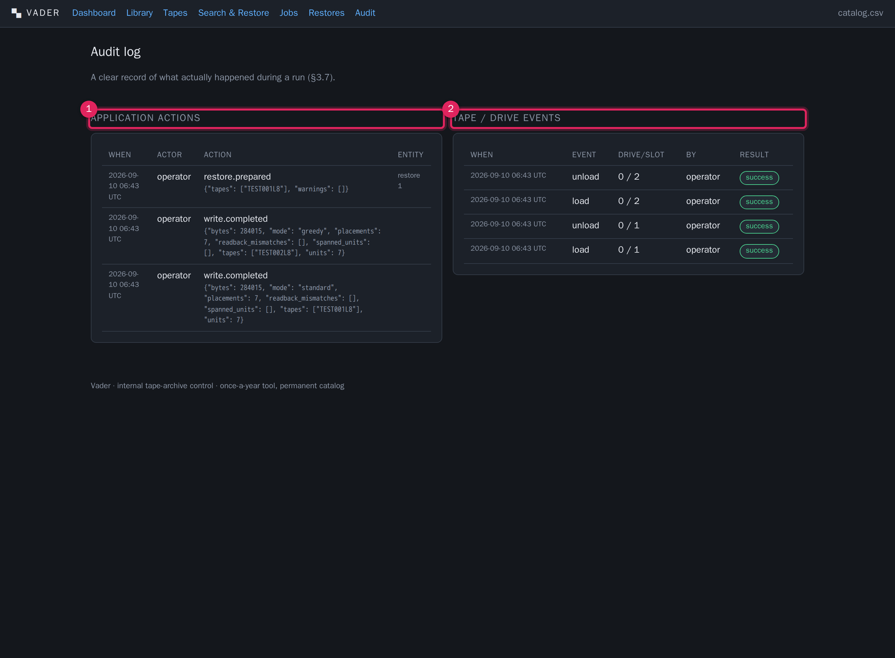

# Audit log

**What this covers:** the `/audit` screen — what Vader records, and how to read the
two logs it keeps.

Because this tool is touched roughly once a year, a clear record of *what actually
happened during this run* is valuable when someone is trying to reconstruct it a
year later. Vader keeps two parallel logs and shows them side by side.

---

1. **Application actions** (`audit_log` table). Higher-level events: catalog edits,
   exports, tape create/edit, format, retire, drive clean, library inventory, and
   the completion of write / verify / restore jobs. Each entry: timestamp, actor,
   action name, a JSON `detail` blob, and the entity it concerns
   (`entity_type` + `entity_id`). Shown 100 per page (newest first), with
   **‹ Prev / Next ›** links; the page number is the `?page=` parameter.
2. **Tape / drive events** (`tape_events` table). Every physical hardware action:
   `load`, `unload`, `write`, `verify`, `inventory`, `format`, `clean`, `retire`,
   `eject`. Each entry: start time, event type, drive / slot numbers, who
   initiated it, and a result pill (`pending` / `success` / `error` / `partial`).
   Shown 100 per page; this column paginates independently via `?epage=`.

The two are complementary: a single "verify tape X" job produces **one**
application action (`verify.completed`, with the result summary in `detail`) and
**several** tape events (`load`, `verify`, `unload`).

---

## What generates a record

| You do | Application action | Tape event(s) |
|---|---|---|
| Library → Refresh inventory | `library.inventory` | `inventory` |
| Library → Load / Unload | — | `load` / `unload` |
| Library → Format | `tape.format` (with `force` flag) | `format` |
| Library → Bulk optimize / format | `tape.format` per tape (with `force` + `batch: true`) | `load` / `format` / `unload` per tape |
| Library → Clean drive | `drive.clean` | `clean` |
| Library → Retire tape | `tape.retire` (with reason) | `retire` |
| Tapes → Register / Edit | `tape.create` / `tape.edit` | — |
| Write job completes | `write.completed` (with full result) | `load` / `unload` per tape |
| Verify job completes | `verify.completed` (with result) | `load` / `verify` / `unload` |
| Prepare restore | `restore.prepared` (tapes + warnings) | — |
| Restore job completes | `restore.completed` (destination, counts, problems) | `load` / `unload` per tape |
| Connections → Add ingest source / restore destination | `connection.add` (hostname, share, purpose, mount path, backend) | — |
| Connections → Remove connection | `connection.delete` (hostname, share, purpose) | — |
| Connection health sweep changes state | `connection.health` (hostname, healthy, error) — only logged on a *transition*, not every sweep | — |
| Restore prepared with a destination connection | `restore.prepared` includes `destination` and `destination_connection` in `detail` | — |

Hardware actions that fail still get a `tape_events` row, with result `error` and
the error text in `error_detail` — visible per tape on the
[tape detail](tapes.md) → Event history panel as well as here.

---

## Reading it during / after a run

- **"What did the write run actually touch?"** — filter your eye to
  `write.completed` in the application log; the `detail` JSON lists `tapes`,
  `spanned_units` and `readback_mismatches`.
- **"Did any hardware action fail?"** — scan the tape/drive events for `error`
  pills.
- **"Who changed this tape's status?"** — look for `tape.edit` on that barcode in
  the application log (also recorded per tape).
- **Actor** is `operator` throughout — Vader is single-operator and does not
  distinguish individuals. If you need per-person attribution, keep that in an
  external log.

There is no filter box or date picker on this screen in the current build — it is
a straight reverse-chronological, page-by-page view (100 rows per page each side).
For structured querying or cross-run analysis, take a
[database backup](exports-durability.md) and query the `audit_log` /
`tape_events` tables directly.
