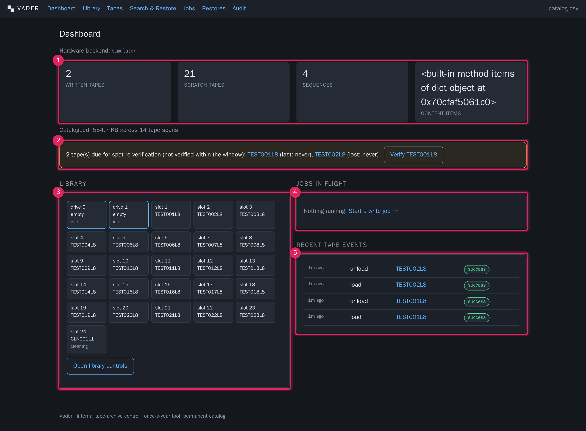

# Dashboard

**What this covers:** the landing screen at `/`. What every number means, how to
read the library map, and which panels are telling you to act.

The Dashboard is read-only — it starts nothing by itself except one shortcut
button. It is the screen to glance at when you sit down: it tells you whether the
library is reachable, how much is catalogued, whether anything is running, and
whether any tapes are overdue for a spot check.

---

1. **Tape and catalog counters (top row).** Four figures:
   - **written tapes** — count of tapes with status `active` or `full` (tapes that
     hold catalogued content).
   - **scratch tapes** — count of tapes with status `scratch` (blank, available
     for the write job to span onto).
   - **sequences** — number of Type-A EXR sequence-container rows in the catalog.
   - **content items** — number of Type-B/C/D content-item rows (video chunks,
     config, audio/media).
   Below the row, a one-line total: *Catalogued: N across M tape spans* — the sum
   of catalogued bytes and the number of span records.
2. **Re-verification reminder (yellow box, only shown when relevant).** Lists every
   tape whose last-verified date is older than `REVERIFY_MONTHS` (default 12) or
   that has never been verified — but only tapes that have actually been written
   to and are not `scratch` or `retired`. Each barcode links to its
   [tape page](tapes.md). The button queues a verify job for the first tape in the
   list. Pull these tapes and verify them even if you are not writing this year —
   see [Verification](verification.md).
3. **Library panel.** A compact map of the physical library as of the last
   `mtx status`: each **drive** (number, loaded barcode or *empty*, and activity —
   `idle` / `reading` / `writing`), then every **storage slot** (number, barcode
   or `—`, and a *cleaning* tag for a cleaning cartridge). **Open library
   controls** jumps to the [Library](library.md) page. If the changer cannot be
   reached, a red *Library unreachable* banner replaces the map and names the
   error.
4. **Jobs in flight.** Any job that is `queued` or `running`, with a live progress
   bar and the current progress message. If nothing is running you get a *Start a
   write job →* shortcut. Full history is on the [Jobs](jobs.md) page.
5. **Recent tape events.** The last dozen hardware events (load, unload, write,
   verify, inventory, format, clean, retire, eject) with a relative timestamp, the
   event type, the tape (linked), and the result pill (`success` / `error` /
   `partial` / `pending`).

---

## How to read it

| You see | It means | Do this |
|---|---|---|
| Red *Library unreachable* banner | Vader cannot talk to the changer | Check `HARDWARE_BACKEND` and `CHANGER_DEVICE`; run `mtx status` by hand. [Troubleshooting](troubleshooting.md) |
| **scratch tapes** is low or 0 | The write job may run out of tape mid-run | Load blank tapes, Refresh inventory, Format any that are not `scratch`. [Library](library.md) |
| Yellow re-verification box present | One or more tapes overdue for a spot check | Queue verify jobs for them. [Verification](verification.md) |
| A job sits at `queued` while another is `running` | Normal — the worker runs one job at a time | Wait, or cancel the running one. [Jobs](jobs.md) |
| A recent event with an `error` pill | A hardware action failed | Open the [tape page](tapes.md) → Event history for the error detail |

> **Note.** The counters and the library map reflect the **last** inventory /
> `mtx status`. If tapes were moved physically, run
> **[Library](library.md) → Refresh inventory** before trusting the map.

The **written tapes** counter includes `active`, `full` and `archived` tapes; if
any tapes are `archived` (sent offsite), the line under the counters says how
many. The **content items** figure is the count of Type-B/C/D rows; the full
breakdown is on the [Search](search-catalog.md) results and in the full-catalog
CSV.
