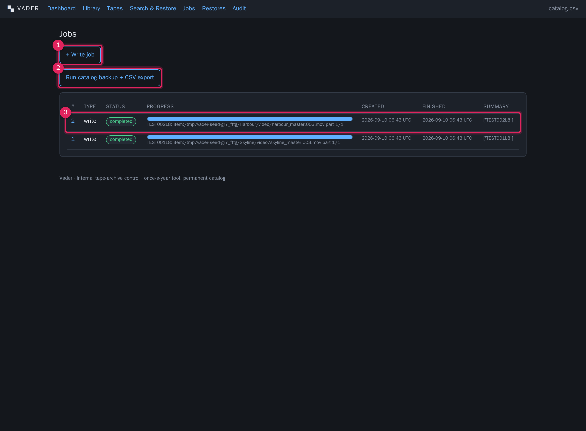

# Jobs

**What this covers:** the background job system — the job types, the one-at-a-time
worker, progress and heartbeat, cancelling and retrying, and what happens to a job
when the application restarts mid-run.

Long operations (copying data, verifying a tape, restoring) run as **persisted
background jobs**, not as web requests that would time out. You start a job and it
survives page reloads and, as a record, an application restart.

---

## The jobs list

1. **+ Write job.** Opens the [new write job form](archiving.md).
2. **+ Verify job.** Opens the [new verify form](verification.md) (barcode, full
   vs sample, drive).
3. **Run catalog backup + CSV export.** Enqueues a `backup` job immediately (no
   form) — see [Exports & durability](exports-durability.md).
4. **One row per job**, 50 per page (newest first) with **‹ Prev / Next ›**
   links: id (links to detail), type, status pill, a progress bar + message,
   created and finished timestamps, and a short summary pulled from the result
   (tapes touched, barcode, or files restored).

Restore jobs are started from [Restore](restore.md), not this page. Verify jobs
can also be started from the [tape page](tapes.md) and the
[Dashboard](dashboard.md) re-verify box.

---

## Job types

| Type | Started from | Does |
|---|---|---|
| `write` | Jobs → + Write job | scan → allocate → copy → checksum → read-back → catalog. [Archiving](archiving.md) |
| `verify` | Jobs → + Verify job; Tape page; Dashboard re-verify box | re-read + re-hash a tape's content, log read errors. [Verification](verification.md) |
| `restore` | Restore request → Run restore | load tapes in order, copy real content back, reassemble splits. [Restore](restore.md) |
| `backup` | Jobs → Run catalog backup + CSV export | write the full-catalog CSV to `DATA_DIR/exports/` and a DB dump to `BACKUP_DIR`. [Exports & durability](exports-durability.md) |

> Format, Clean and Inventory are **not** background jobs — they run immediately
> from the [Library](library.md) page and are recorded as tape events. These four
> are the only job types.

---

## The worker — one job at a time

Tape hardware is serial: one changer, two drives, one operator. Vader matches that
with **a single background worker thread** inside the application process:

- It polls about every 1.5 seconds for the **oldest `queued`** job and claims it.
- It runs that job to completion (or failure/cancel) before looking at the next
  one.
- So a second job you start while one is running sits at `queued` — that is
  normal, not stuck. The [Dashboard](dashboard.md) "Jobs in flight" panel shows
  both.

Stopping `uvicorn` stops the worker cleanly.

---

## Job statuses

| Status | Meaning |
|---|---|
| `queued` | Waiting for the worker. |
| `running` | The worker is on it now. |
| `completed` | Finished; `result` is populated. |
| `failed` | Threw an error; `error` holds the message + traceback. |
| `cancelled` | You requested cancel and it stopped (or it was cancelled while still queued). |
| `interrupted` | The application restarted while this job was `running`. Safe to re-run. |

---

## Progress and heartbeat

The [job detail](archiving.md) page (call-outs shown in the Archiving chapter)
shows:

- a **status pill** and a **heartbeat** timestamp — updated every time the job
  reports progress; a heartbeat that has not moved for a long time on a `running`
  job suggests it is blocked (e.g. on a slow or failing drive);
- a **progress bar** from `progress_current / progress_total` — **bytes** for a
  write job, **checks** for a verify, **files** for a restore;
- a live **message** (current tape / unit / file);
- **Parameters** (as submitted) and, once finished, **Result** or **Error**.

While a job is `queued` or `running` the page auto-refreshes every 2 seconds.

---

## Cancelling a job

On the job page, **Request cancel** (shown only while `queued` or `running`):

- A **queued** job is cancelled immediately.
- A **running** job is asked to stop cooperatively — it sets a cancel flag that
  the job checks at each safe boundary (the next placement for a write, the next
  file for a restore, the next check for a verify). It does not kill mid-copy.
- Work already committed to the catalog stays; a write is idempotent so a
  cancelled write can be resumed by re-running it.

---

## Retrying a job

**Re-run with same parameters** (shown once a job is `completed`, `failed`,
`cancelled` or `interrupted`) creates a **new** `queued` job with the same type
and parameters. It does not mutate the old job. For `write` and `verify` this is
safe and idempotent:

- a re-run **write** skips every unit whose span is already written (and
  verified);
- a re-run **verify** just re-reads.

Load more scratch tapes first if the original failure was *out of scratch tapes*.

---

## Interrupted-on-restart behaviour

When the application starts, the worker's first action is to find any job still
marked `running` (there should be at most one) and set it to `interrupted` with
the note *worker restarted while this job was running — safe to re-run*.

So after a VM reboot or a crash:

1. Open [Jobs](jobs.md).
2. Any `interrupted` job is a job that did not finish. Open it and
   **Re-run with same parameters**.
3. For a write job, top up scratch tapes first if needed. The re-run continues
   from where it left off without duplicating catalog rows.
