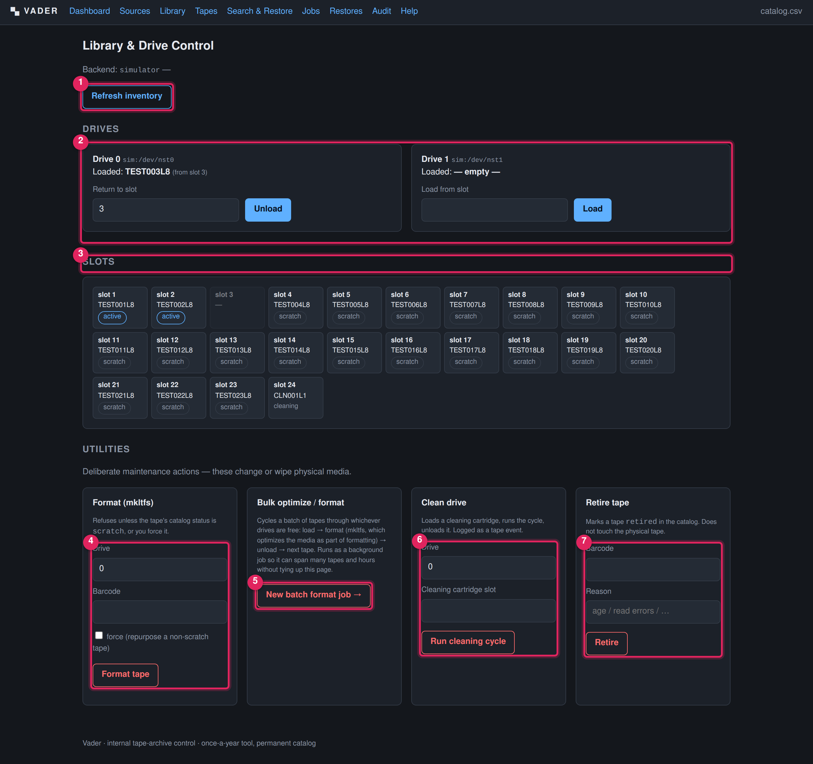

# Library & drive control

**What this covers:** the `/library` screen — the day-to-day physical operations:
refreshing the inventory, loading and unloading tapes by hand, and the Utility
actions (Format, Bulk optimize/format, Clean drive, Retire tape). Every action
here is written to the tape-event log and, for most, the [audit log](audit-log.md).

This screen replaces the ML3 changer web page. During a write or restore **job**
you do *not* need to load and unload here — the job does that itself. Use this
page for setup, for recovering from a wedged state, and for the Utilities.

---

1. **Refresh inventory.** Wraps `mtx inventory`: re-reads every barcode from the
   changer and replaces Vader's cached slot map. Run it whenever tapes have been
   added, removed or swapped outside the app. Any barcode Vader has not seen
   before is **auto-registered as a `scratch` tape** with its slot as the physical
   location.
2. **Drives.** One panel per drive, showing the device node, the loaded barcode
   (or *— empty —*), the slot it came from, and the LTFS mount point if mounted.
   - If the drive is **empty**: a *Load from slot* field + **Load** button.
   - If the drive is **loaded**: a *Return to slot* field (pre-filled with the
     origin slot) + **Unload** button.
   Load/unload here is a manual convenience; it is logged exactly like a job's
   load/unload.
3. **Slots.** The full storage-slot map: slot number, barcode (or `—`), a
   *cleaning* tag for a cleaning cartridge, and a status pill for any slot whose
   barcode is a known tape (`scratch` / `active` / `full` / …).
4. **Utilities → Format (mkltfs).** Prepares a **single, already-loaded** tape for
   LTFS use. **Refuses unless the tape's catalog status is `scratch`**, unless you
   tick **force**. Fields: *Drive* (the tape must already be loaded in that
   drive), *Barcode*, *force*. On success the tape is (re)set to `scratch`, its
   used-bytes reset to 0, its write-pass count incremented by one, and any
   "dedicated to" (greedy) marker cleared. This is an immediate action, not a job
   — use it for one tape you already have sitting in a drive.
5. **Utilities → Bulk optimize / format.** For preparing many tapes at once
   (e.g. a new batch of LTO-9 stock before an annual run). Opens the
   [new batch format job](jobs.md#job-types) form — see [below](#batch-optimize-format-many-tapes-at-once).
6. **Utilities → Clean drive.** Loads a cleaning cartridge from the given slot into
   the drive, runs the cleaning cycle, and unloads it. Fields: *Drive*, *Cleaning
   cartridge slot*. The slot must actually hold a cleaning cartridge or the action
   fails. Logged as a `clean` tape event.
7. **Utilities → Retire tape.** Marks a tape `retired` in the catalog and appends
   the reason to its notes. **Does not touch the physical tape** and does not need
   it to be in the library. A retired tape is excluded from the writable pool and
   from the re-verification reminder. Fields: *Barcode*, *Reason*. Redirects to the
   [tape page](tapes.md) on success.

> **The Utilities are destructive or state-changing on purpose, and are kept in
> their own section away from the routine load/unload controls.** Read the field
> notes before using Format with **force** — it will happily `mkltfs` a tape that
> still has catalogued content if you force it.

---

## Common procedures

### Refresh the inventory after swapping tapes

1. Physically add/remove/swap cartridges in the library.
2. **Library → Refresh inventory.**
3. Check the slot map matches what you just did.
4. New barcodes now appear in the [Tapes](tapes.md) list as `scratch`. Set their
   LTO generation / capacity there if you want accurate free-space maths (the
   write allocator falls back to `SIM_TAPE_CAPACITY_BYTES` / a default when
   capacity is unset).

### Load a tape into a drive by hand

1. Note the tape's slot number from the Slots map.
2. In the empty drive's panel, type the slot number in *Load from slot*.
3. **Load.** The Slots map and drive panel refresh.

### Unload a tape back to a slot

1. In the loaded drive's panel, confirm/adjust the *Return to slot* number (it
   defaults to the slot the tape came from).
2. **Unload.** If the tape is still LTFS-mounted, Vader unmounts it first.

### Format a fresh (or repurposed) tape for LTFS

1. Load the tape into a drive (above).
2. **Utilities → Format**: enter the *Drive* and *Barcode*.
3. If the tape's status is not `scratch` and you genuinely mean to wipe it, tick
   **force**.
4. **Format tape.** The tape is now `scratch` and ready for a write job.

### Batch optimize / format many tapes at once

Use this instead of the single-tape Format above when you're preparing a whole
new batch of stock — it does **not** require loading tapes into drives by hand
first; it does that itself, tape by tape, across every drive that's free.

1. **Utilities → Bulk optimize / format** → opens the new batch-format job form.
   The barcode list is **pre-filled with every tape currently catalogued as
   `scratch`**; edit it (one barcode per line, or comma-separated) to the actual
   set you want to run.
2. Tick **force** only if some of the listed tapes aren't `scratch` and you
   genuinely mean to wipe/repurpose them.
3. **Queue batch format job.** Vader checks every listed tape's status *before*
   touching any hardware — the whole batch is refused up front if one isn't
   `scratch` and you didn't tick force, so it can't fail partway through.
4. Track it like any other job on the [Jobs](jobs.md#job-types) page. Each free
   drive picks up the next tape from the list on its own: load → `mkltfs`
   (which performs LTFS's built-in media-optimize pass as part of formatting —
   there is no separate "optimize" step) → unload back to its home slot → next
   tape. One bad tape is recorded as failed without stopping the rest of the
   batch; the finished job's **Result** lists which barcodes succeeded, which
   failed (with why), and which were skipped if you cancelled partway through.

> Formatting/optimizing can take a long time per tape — up to ~2 hours on
> LTO-9 with some LTFS builds, since the format step always re-runs the
> optimize pass regardless of the tape's prior state. A batch of many tapes is
> exactly why this runs as a background job spread across every free drive
> rather than one at a time.

### Retire a tape pulled from rotation

1. **Utilities → Retire tape**: enter the *Barcode* and a *Reason*
   (e.g. "read errors 2027-03", "age / write-pass count").
2. **Retire.** You land on the tape page with status `retired`.
3. If you still have a live source for its content, re-archive it before the tape
   degrades further.

---

## Field reference

| Control | Field | Notes |
|---|---|---|
| Load | `slot`, `drive` | Slot must be occupied; drive must be empty. |
| Unload | `slot`, `drive` | Drive must be loaded; target slot must be free. |
| Format | `drive`, `barcode`, `force` | Tape must be loaded in `drive`. Blocks non-`scratch` tapes unless `force`. |
| Bulk optimize / format | `barcodes` (list), `force` | Runs as a job, not immediately. Loads/formats/unloads each tape itself, across every free drive. Blocks non-`scratch` tapes unless `force`. |
| Clean | `drive`, `cleaning_slot` | `cleaning_slot` must hold a cleaning cartridge. |
| Retire | `barcode`, `reason` | Catalog-only; physical tape untouched. |

> **Eject / return-to-slot.** The framework design mentions a separate "eject"
> action; in the current build the equivalent is simply **Unload** on the drive
> panel. The `eject` event type exists in the data model but has no dedicated
> button.
