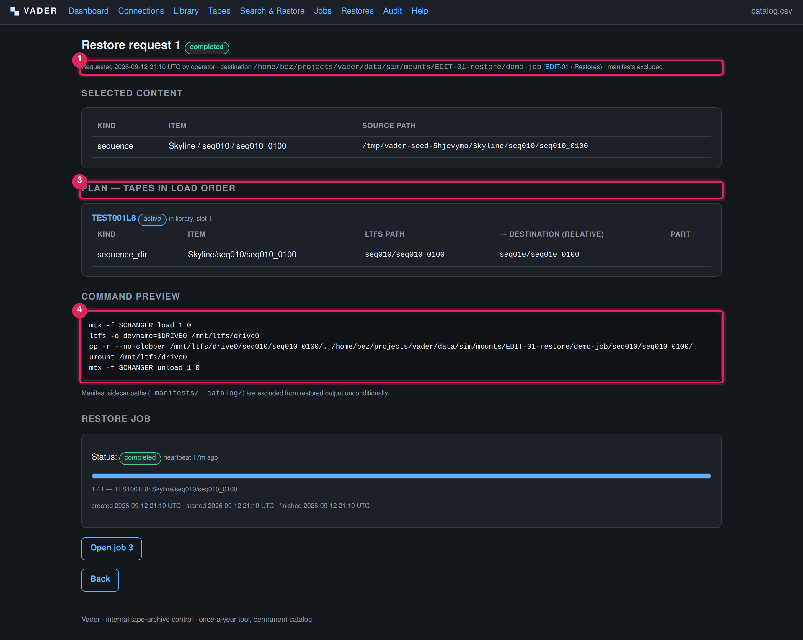
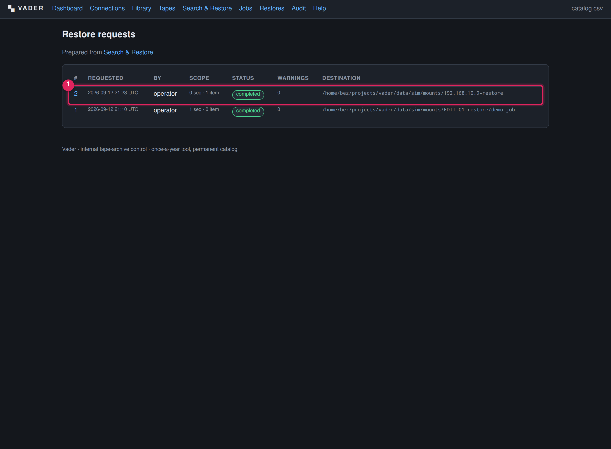

# Restore

**What this covers — this is the primary chapter.** Getting content back off tape:
searching the catalog, selecting items, generating a prepare-restore plan (tape
load order, command preview, blocking warnings), running the restore, how
multi-tape and byte-split content is reassembled, how restored data is checked,
and why manifest sidecars never appear in restore output.

A restore turns "recover shot X" from a manual archaeology exercise into a guided,
auditable action: Vader works out exactly which tapes are involved, in what order,
warns you up front if one is missing or damaged, and then loads, copies and checks
them for you.

---

## 1. The restore workflow at a glance

```
Search the catalog  ─►  tick the items you want  ─►  Prepare restore
                                                          │
                                                          ▼
                                             Restore request (a saved plan):
                                               • tapes in load order
                                               • per-file plan (LTFS path → dest)
                                               • command preview
                                               • warnings (blocking or not)
                                                          │
                              resolve any blocking warnings (fetch the tape…)
                                                          │
                                                          ▼
                                                    Run restore  ─►  restore job
                                                          │
                                            loads each tape in turn, copies only
                                            real content into the original tree,
                                            reassembles byte-split files,
                                            checksums whole-file restores
```

---

## 2. Search and select

Use **Search & Restore** (`/search`). Full filter reference is on the
[Search the catalog](search-catalog.md) page; in brief you can filter by free
text, project, source machine, backup category, content type, tape barcode, and a
written-date range.


1. **Filter form.** Fill any combination and **Search**.
2. **Restore destination.** Three ways to say where the restored tree is written,
   in priority order:
   - **Restore destination connection** — a dropdown of every healthy
     [restore-destination connection](connections.md#5-restoring-to-a-destination-connection).
     Picking one wins over the fields below it.
   - **Subpath under connection** (optional) — only used if a connection is
     picked; namespaces this restore under its own folder (e.g.
     `RestoreJob-2027-03`) instead of writing straight into the share's root.
   - **Custom path on this host** — a raw filesystem path on the Vader VM,
     used only if no connection is selected. Leave everything blank to use
     `DATA_DIR/restores/restore-<id>/`.
3. **Include manifests (review copy only).** Off by default. See §7 — even when on,
   manifests never go into the *deliverable* path.
4. **Prepare restore.** Builds the plan from the ticked rows and takes you to the
   restore request page.
5. **Result rows.** One per matching sequence or item; tick the checkbox on the
   left to include it.
6. **Tapes column.** For each result, the tape barcode(s), a `p2/3` tag for a
   spanned item, and the current slot or location plus the exact LTFS path. This
   is where a tape shows as *in library* / *slot N* / an offsite location.

Select everything you need in one go — the plan can span many tapes and Vader will
sequence them.

---

## 3. The prepare-restore plan



1. **Header line.** Request id + status pill, who requested it and when, the
   **destination path** (linked back to the connection, if one was used), and
   whether **manifests** are included (review copy) or excluded.
2. **Warnings box** (only if there are warnings):
   - *tape `<barcode>` is not in the library (location: …) — fetch it before
     running* — **blocking**, no run button until resolved.
   - *tape `<barcode>` is flagged DAMAGED — restore may fail* — not blocking;
     shows a **Run despite warnings** button instead.
   - *restore destination `<hostname>` is not currently healthy (…) — check
     Connections before running* — not blocking either, but worth checking
     [Connections](connections.md) first so the restore doesn't fail on a
     share that's actually just offline.
3. **Selected content.** The sequences and items you picked, with their original
   source paths.
4. **Plan — tapes in load order.** One panel per tape: barcode (linked), status
   pill, *in library / slot N* or a red **NOT IN LIBRARY** with the last known
   location, and a table of the files to pull from that tape — kind, label, LTFS
   path, the **relative destination** it will be written to, and a part indicator
   for spanned items.
5. **Command preview.** The equivalent `mtx load` / `ltfs` / `cp` (or `cat >>` for
   byte-split parts) / `umount` / `mtx unload` sequence, for reference or to run by
   hand if you ever need to. Below it, a reminder that `_manifests/` and
   `_catalog/` are excluded unconditionally.
6. **Run restore** button. Label and behaviour depend on status — see §4.

### Request status

| Status | Meaning |
|---|---|
| `ready` | No warnings. Safe to run — the button reads **Run restore**. |
| `pending` | Has warnings. What the page shows depends on the *kind* of warning (below). |
| `in_progress` | A restore job is running. |
| `completed` | Restore job finished with no problems. |
| `failed` | Restore job hit one or more problems (see the job result). |
| `cancelled` | The restore job was cancelled. |

There are two kinds of warning, handled differently:

- **A required tape is *not in the library*** — this is a hard block. The page
  shows a **Cannot run yet** badge and no run button. Physically fetch the tape,
  run **[Library](library.md) → Refresh inventory** so Vader sees it in a slot,
  then prepare the restore again.
- **A required tape is flagged `DAMAGED`** (but present) — the page shows a red
  **Run despite warnings** button. Clicking it runs the restore; Vader attempts
  the damaged tape and reports any unreadable file individually in the job
  result (`problems`), ending the request as `failed` if any file could not be
  recovered. Use this when you have decided the tape is worth attempting.

---

## 4. Running the restore

1. If a tape is *not in the library*, fetch it and re-inventory, then prepare the
   restore again so it comes back `ready`.
2. Open the restore request and click **Run restore** (`ready`) or **Run despite
   warnings** (`pending` because of a `DAMAGED` tape you have chosen to attempt).
3. A **restore job** is enqueued and linked from the request page; open it to watch
   progress (`progress_current / progress_total` = files done / total).
4. For each tape in load order the job:
   - loads it from its slot (if it is in a slot) and mounts the LTFS volume;
   - copies each planned file into the destination tree, reproducing the original
     directory layout;
   - unmounts and returns the tape to a free slot;

   Within a **sequence folder**, a frame that already exists at the target is left
   as-is (not re-copied). Individual **whole files** and reassembled **byte-split**
   files are written to their target path regardless of what is there — restore
   into a fresh or empty destination if you need to be sure nothing is
   overwritten.
5. When all tapes are done the request becomes `completed` (or `failed` if any
   file had a problem).

If a restore-destination connection was picked, the output lands under that
connection's mount path (plus the subpath, if one was given) exactly as if you
had typed that resolved path by hand — the restore job itself has no notion of
"connection", it only ever sees the final destination path. If nothing at all
was picked or typed, the output lands in `DATA_DIR/restores/restore-<id>/`.

---

## 5. Multi-tape and byte-split reassembly

- **A shot or file that spans several tapes** has one plan entry per tape. Vader
  loads the tapes in order and copies each part. For a **Type-A sequence** the
  frames from each tape are copied into the same destination folder, reproducing
  the whole shot.
- **A byte-split single file** (written as `<name>.partNNN` across tapes) is
  reassembled by appending the parts in index order into one file at the original
  name — part 0 opens the file, later parts append. The `.partNNN` suffix does not
  appear in the output.
- **Whole-file restores are checksum-verified**: after copying, Vader re-hashes the
  restored file and compares to the span's stored SHA256. A mismatch is recorded
  as a problem and fails the request. (Byte-split parts and sequence directories
  are copied without a post-restore re-hash in the current build — verify the
  source tapes separately with a [verify job](verification.md) if you need that
  assurance.)

Any per-file problem (missing on tape, read error, checksum mismatch) is collected
into the job result's `problems` list; the destination keeps whatever did copy
successfully.

---

## 6. Verifying restored data

1. Open the restore **[job](jobs.md)** result. Confirm `problems` is `[]` and
   `files_restored` matches what you expected.
2. Spot-check the destination tree: directory structure should match the original
   `source_path` shown on the search result, with no `_manifests/` or `_catalog/`
   anywhere in it.
3. For extra assurance on the tapes themselves, run a **full**
   [verify job](verification.md) on each source tape.

---

## 7. Manifest exclusion (why your restore is clean)

The sidecar `_manifests/` (frame checksums) and `_catalog/` (per-tape CSV) paths
are **never written into restore output**, unconditionally. This matters because a
restore must reproduce the original shot directory exactly for whatever pipeline
consumes those frames next — a stray manifest JSON inside a shot folder could
confuse it.

- Exclusion happens at two points: when the plan is built (excluded spans are
  dropped) and again when files are copied (excluded paths are skipped).
- The **Include manifests (review copy only)** checkbox does **not** put manifests
  into the deliverable tree. It is a deliberate, separate opt-in for a *review*
  copy — use it only when you specifically need a manifest to hand-check a
  restored sequence, and treat that output as inspection material, not a
  deliverable.

---

## 8. The restores list



`/restores` lists every restore request: id, when and by whom, scope (how many
sequences / items), status pill, warning count, and destination path. Use it to
find an earlier restore or re-open one that failed (fix the cause, then
**Run restore** again — the request can be re-run from `ready`, `pending` or
`failed`).
