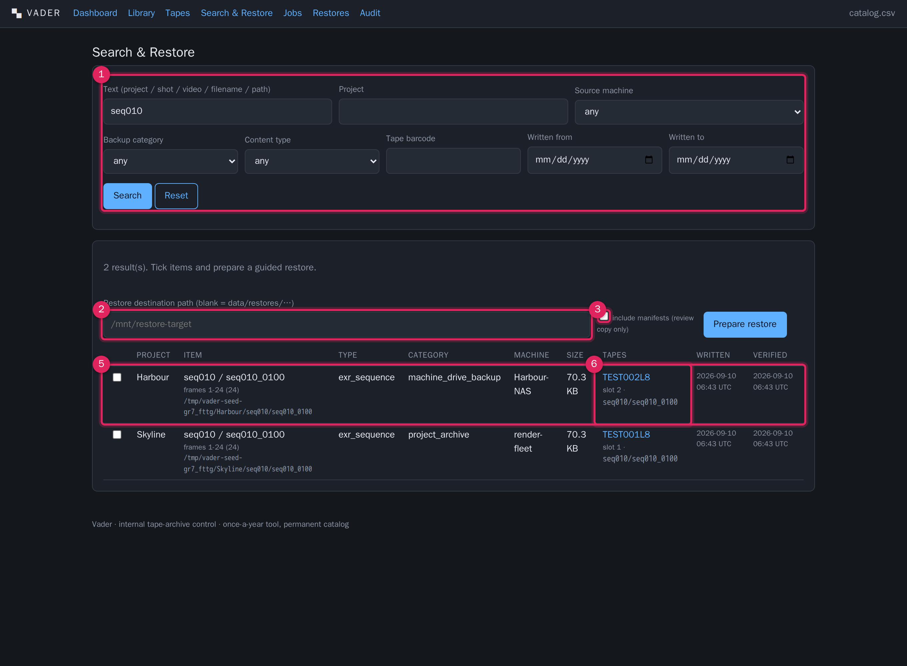

# Search the catalog

**What this covers:** the Search & Restore screen (`/search`) used purely as a
lookup tool — every filter, how a result maps back to tapes and slots, and how to
get the data out as a spreadsheet. Using search as the first step of a restore is
covered in [Restore](restore.md).

The catalog is the whole point of Vader: it turns a wall of barcoded cartridges
into "shot `seq010_0100` is on `TEST002L8`, slot 2, at `seq010/seq010_0100`".

---

The numbered call-outs above are described in [Restore](restore.md) §2. This page
focuses on the **filters** (call-out 1) and the **result → tape mapping**
(call-out 6).

---

## Filters

All filters are optional and combine with AND. The results panel only appears once
you have set at least one filter and pressed **Search**.

| Filter | Field name | What it matches |
|---|---|---|
| **Text** | `q` | Case-insensitive substring against, for sequences: project / sequence / shot name and source path; for items: project / video name / filename and source path. |
| **Project** | `project` | Case-insensitive substring of the project name. |
| **Source machine** | `source_machine` | Exact match. The dropdown is populated from the distinct source-machine values already in the catalog. |
| **Backup category** | `backup_category` | `project_archive` or `machine_drive_backup`. |
| **Content type** | `content_type` | Dropdown labelled *EXR image sequence (Type A)*, *Video chunk (Type B)*, *Config / log file (Type C)*, *Audio / media file (Type D)* — submitting values `exr_sequence` / `video_chunk` / `config` / `audio_media`. *EXR image sequence* searches only sequence containers; any other value searches only content items. |
| **Tape barcode** | `tape_barcode` | Restricts results to content with at least one span on that exact tape. An unknown barcode returns nothing. |
| **Written from** / **Written to** | `written_from` / `written_to` | Date range on the content's write timestamp. |

Results are capped at 200 rows and sorted by project then title. **Reset** clears
everything.

---

## Reading a result row

Each row is one **sequence** (Type A) or one **item** (Type B/C/D):

| Column | Notes |
|---|---|
| checkbox | Tick to include the row in a prepare-restore. |
| Project | Derived project name. |
| Item | Title + a subtitle line. For a sequence: `frames <start>-<end> (<count>)` and, if the folder has gaps, `GAPS: <ranges>`. For a video chunk: `<video> — chunk <i>/<n>`. Plus the original source path in monospace. |
| Type | `exr_sequence` / `video_chunk` / `config` / `audio_media`. |
| Category | `project_archive` or `machine_drive_backup`. |
| Machine | Source machine, or `—`. |
| Size | Total size (sequence folder total, or file size). |
| **Tapes** | One entry per span — see below. |
| Written / Verified | Timestamps. An empty **Verified** means it has not passed a read-back or verify check. |

### The Tapes column — how a result maps to physical media

For each span the row shows:

- the **barcode** (links to the [tape page](tapes.md));
- a **`p<i>/<n>`** tag if the content is split across tapes (part *i* of *n*);
- the **current location**: `slot N` if the tape is in a library slot right now,
  otherwise the tape's recorded physical location (a shelf/box reference for an
  offsite tape, or `unknown`);
- the exact **LTFS path** on that tape, in monospace.

A sequence or file with two tape entries is one that **spanned** at write time —
a restore will load both, in order.

---

## Exporting search-style data

The search screen itself has no "export these results" button. To get catalog data
into a spreadsheet:

| You want | Use |
|---|---|
| Everything, every tape, with checksums | Top bar → **catalog.csv** (`/export/catalog.csv`) |
| One tape's full contents | [Tape page](tapes.md) → **Export tape CSV** (`/export/tape/<barcode>.csv`) |
| A point-in-time copy on the share | [Jobs](jobs.md) → **Run catalog backup + CSV export** |

The full-catalog CSV has one row per span with all identifying fields, sizes,
`sha256`, `manifest_ref` (for Type A), `written_at` and `verified_at`. Filter and
pivot it in a spreadsheet to answer anything the on-screen search does not. It is
also the fallback record if the database is ever lost — see
[Exports & durability](exports-durability.md).
