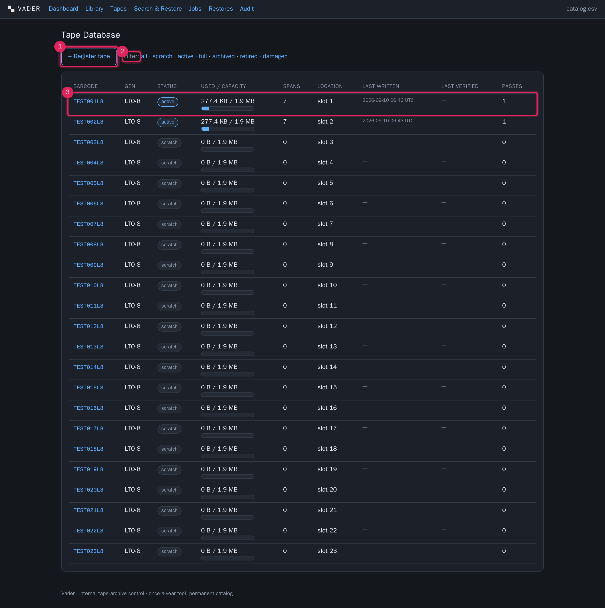
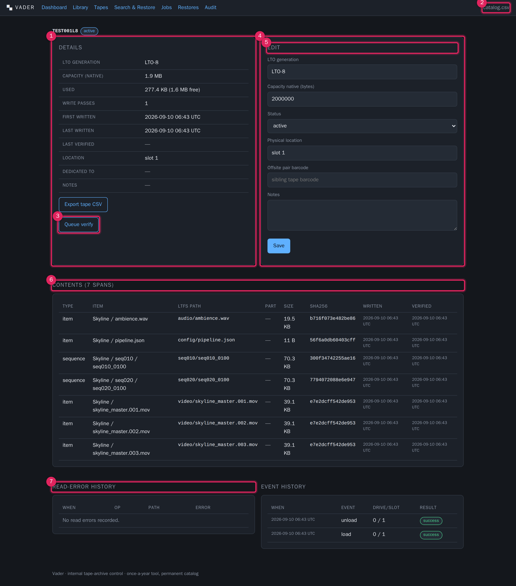

# Tapes

**What this covers:** the `/tapes` list and the per-tape detail page. Tape
statuses and what moves a tape between them, every editable field, physical
location and offsite pairing, the "dedicated to" marker used by greedy write mode,
and the per-tape contents, event history and read-error history.

One row in the tape database = one physical LTO cartridge, keyed by barcode.

---

## The tape list

1. **+ Register tape.** Add a tape by hand (see below). You normally do *not* need
   this — **[Library](library.md) → Refresh inventory** auto-registers any barcode
   it sees as `scratch`.
2. **Status filter.** `all`, then one link per status. The active filter is bold.
3. **One row per tape**, 50 per page (sorted by barcode) with **‹ Prev / Next ›**
   links below the table; the status filter is preserved across pages. Columns:
   barcode (links to detail), LTO generation, status pill, used / capacity with a
   small bar, span count (pieces of content on the tape), physical location,
   last-written date, last-verified date, and write-pass count.

---

## Tape statuses

| Status | Meaning | How a tape gets here |
|---|---|---|
| `scratch` | Blank / available. The write job may format it and span onto it. | Auto-registered on inventory; set by **Format**; set manually. |
| `active` | Holds catalogued content and still has room. | Set automatically at the end of a write job when the tape has more than 2% free. |
| `full` | Holds catalogued content and is essentially full. | Set automatically at the end of a write job when less than 2% of capacity is free. |
| `archived` | Written, verified, and sent to permanent offsite storage. Excluded from the writable pool; still appears in the re-verify reminder and counts toward "written tapes" on the dashboard. | **Set manually** on the tape page (Status → `archived`) once the tape is offsite. |
| `retired` | Pulled from rotation; excluded from the writable pool and the re-verify reminder. | **[Library](library.md) → Utilities → Retire**, or set manually. |
| `damaged` | Known bad. Blocks a restore that needs it until you override. | **Set manually** on the tape page after reviewing a verification failure. Vader never sets this automatically. |

> **Verification never auto-marks a tape `damaged`.** A checksum mismatch appends
> a dated line to the tape's **notes** and the mismatch is listed in the verify
> job result; deciding the tape is `damaged` is your call. See
> [Verification](verification.md).

Only `scratch` and `active` tapes are considered by the write allocator.
`retired`, `damaged` and `archived` tapes are skipped entirely; `full` tapes are
not written to again.

---

## The tape detail page

1. **Details panel.** Read-only summary: LTO generation, native capacity, used
   (and free), write passes, first/last written, last verified, current location,
   **Dedicated to** (the source machine this tape is locked to under greedy mode,
   or `—`), and free-text notes (verification appends dated mismatch lines here).
2. **Export tape CSV.** Downloads the full content listing for this one tape,
   checksums included — the same file that is also written onto the tape at
   `/_catalog/<barcode>.csv`. Good as a physical insert / label source. See
   [Exports & durability](exports-durability.md).
3. **Queue verify.** Enqueues a verify job for this tape (sample verification by
   default). See [Verification](verification.md).
4. **Edit panel.** The editable fields (see table below). **Save** writes them and
   records a `tape.edit` audit entry.
5. **Contents.** One row per span on this tape: type (`sequence` / `item`), the
   item title, the LTFS path, the part indicator (`2/3` if this is part 2 of a
   3-tape span, else `—`), size, the first 16 characters of the SHA256, and the
   written / verified timestamps.
6. **Read-error history.** Every SCSI/LTFS read error logged against this tape
   during verification: when, operation, LTFS path, and the error text. A growing
   list here is a degrading tape — plan to re-archive from a live source while you
   still can.
7. **Event history.** The last 50 hardware events for this tape (load, unload,
   write, verify, format, clean, retire), each with drive/slot, result pill, and
   any error detail.

### Editable fields

| Field | Notes |
|---|---|
| LTO generation | Free text, e.g. `LTO-8`, `LTO-9`. Informational. |
| Capacity native (bytes) | Used by the write allocator for free-space maths. Leave set correctly for accurate spanning. |
| Status | Any of the six statuses. Setting `damaged` here is how you flag a bad tape after a verify failure. |
| Physical location | Free text. Auto-updated to `drive N` / `slot N` by load/unload; set it to a shelf/box reference when a tape leaves the library for offsite storage. |
| Offsite pair barcode | The barcode of a sibling (duplicate) tape. Vader stores the link if that barcode exists. |
| Notes | Free text. Verification appends dated mismatch lines; Retire appends the retire reason. |

> **"Dedicated to" / greedy isolation.** When a write job runs in **greedy** mode
> for a given source machine, every tape it writes gets stamped with that machine
> name. From then on the allocator will only put *that* machine's data on the
> tape, and will not span that machine's data onto a tape belonging to anyone
> else. **Format** clears the marker. You cannot set it by hand on this page — it
> is managed by the write job. See [Archiving](archiving.md).

---

## Registering a tape by hand

Use this only for tapes that are not physically in the library yet (e.g. pre-
recording an offsite sibling), since inventory registers real tapes for you.

1. **Tapes → + Register tape.**
2. Enter the **Barcode** (required). Optionally LTO generation, native capacity,
   status (defaults to `scratch`), physical location, notes.
3. **Create.** A duplicate barcode is rejected. You land on the new tape's page.
